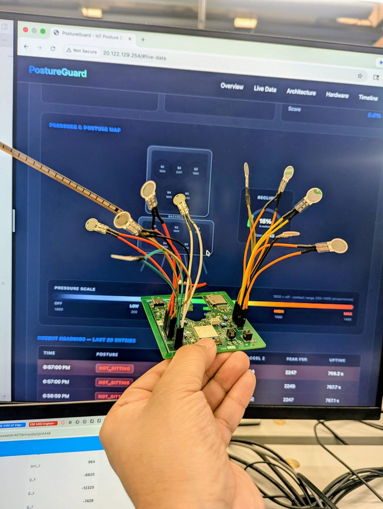
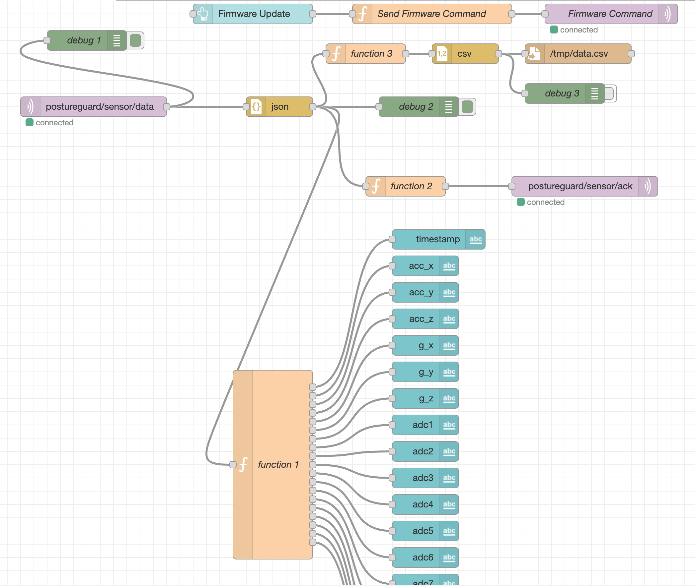
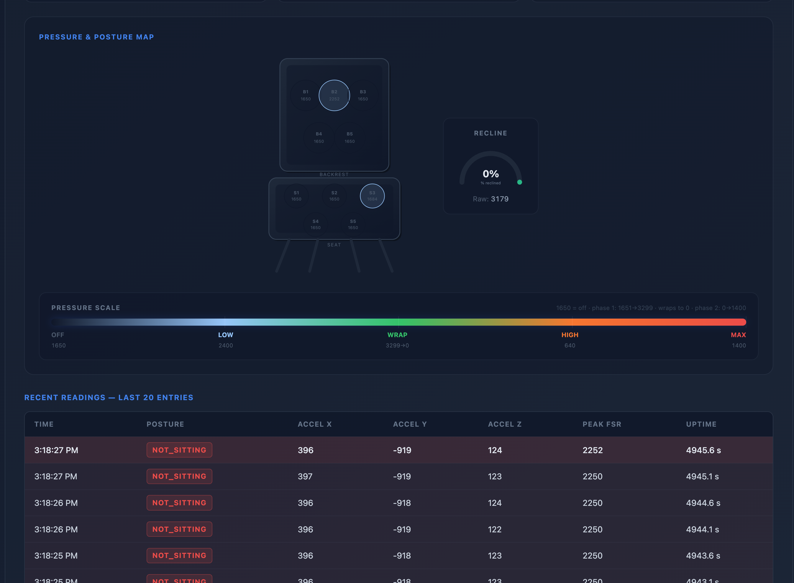

[](https://classroom.github.com/a/Y5lYn2wb)

# a11g-final-submission

**Team Number:** T05

**Team Name:** PostureGuard

| Team Member Name | Email Address | GitHub Username |
| ---------------- | ------------- | --------------- |
| Aditya Agarwal         | aditya10@seas.upenn.edu     | aditya10-source    |
| Vihaan Ravishankar         | vihaan1@seas.upenn.edu     | vihaanpenn    |

[GitHub Repository URL](https://github.com/ese5160/a11g-final-submission-s26-s26-t05-postureguard.git)

## 1. Video Presentation

## 2. Project Summary

### Posture Detection and Monitoring Device

#### Device Description

Our posture detection and monitoring device provides real-time feedback for poor sitting posture through a wearable haptic interface. The system detects when a user slouches or reclines excessively and vibrates to encourage corrective movement, with live data visualized in a cloud-connected web dashboard.

The inspiration came from understanding that chronic poor posture leads to back pain and musculoskeletal issues—problems that are nearly invisible until they cause damage. A reactive, passive alert system that the user can feel immediately addresses the core issue: awareness. Rather than passive logging, the haptic motor makes postural feedback instantaneous and tangible.

#### Internet Augmentation

The device leverages Azure cloud infrastructure to centralize data processing and provide persistent analytics. All sensor data streams wirelessly from the MCU to an Azure VM running Node-RED, which handles real-time alert logic, data aggregation, and historical trend analysis. Users access a live web dashboard (HTML + index.html frontend) that displays current posture metrics, alert history, and progress tracking. This cloud connectivity transforms a standalone sensor device into a complete monitoring ecosystem—enabling remote insights, pattern recognition across sessions, and caregiver oversight.

---

### Device Functionality

The device integrates 10 distributed pressure sensors across a chair or cushion pad to measure seat contact distribution, a flex sensor to track recline angle, and a 6-DOF IMU for detecting spinal tilt and rotation. These sensors feed into a custom PCB built around the **SiWx917 wireless MCU**, which performs sensor fusion and hosts the alert logic. When posture deviates beyond configurable thresholds—asymmetric pressure, excessive recline, or slouching detected by the IMU—the MCU triggers a haptic vibration motor to alert the user in real-time.

All sensor data streams wirelessly to an Azure VM running Node-RED for centralized processing and storage. A lightweight web dashboard displays live posture metrics, alert history, and trend analysis, allowing users and caregivers to monitor posture correction progress.

#### System-Level Block Diagram

```
┌─────────────────────────────────────────────────────────────┐
│                      SENSOR TIER                             │
├──────────────┬──────────────┬──────────────────────────────┤
│  Pressure    │  Flex        │  IMU (6-DOF)                 │
│  Sensors(10) │  Sensor      │  Rotation & acceleration     │
└──────┬───────┴──────┬───────┴──────────┬────────────────────┘
       │              │                  │
       └──────────────┼──────────────────┘
                      │
                      ▼
┌─────────────────────────────────────────────────────────────┐
│              CUSTOM PCB + SiWx917 MCU                        │
│  • I²C/UART sensor interface                                │
│  • Sensor fusion & posture detection                        │
│  • Haptic motor control & feedback                          │
│  • WiFi wireless transmission                               │
└─────────────────────────────────────────────────────────────┘
                      │
                      │ WiFi
                      ▼
┌─────────────────────────────────────────────────────────────┐
│              AZURE VM + NODE-RED                             │
│  • Real-time data processing & aggregation                  │
│  • Alert logic & thresholds                                 │
│  • Historical data storage                                  │
└─────────────────────────────────────────────────────────────┘
                      │
                      ▼
┌─────────────────────────────────────────────────────────────┐
│          BROWSER DASHBOARD (index.html)                      │
│  • Live posture metrics & visualizations                    │
│  • Alert history & trends                                   │
│  • User-facing configuration                                │
└─────────────────────────────────────────────────────────────┘
```

#### Hardware Setup



#### Cloud Dashboard



#### Web Interface



---

### Challenges

#### Hardware Bring-Up Issues

We discovered three critical issues during initial PCB testing:

- **Missing battery charger connector:** The connector was completely absent from the board layout, leaving no way to charge the battery.
- **DNP jumpers that were actually required:** Several jumpers marked as "Do Not Populate" turned out to be essential for sensor configuration and power distribution.
- **Unsoldered SMT resistor:** A critical pull-up resistor for I²C communication was missing from the reflow process.

**How we overcame it:** We hand-soldered the missing connector using fine-pitch soldering techniques, populated the required jumpers, and reflowed the missing resistor. While time-consuming, this approach was faster than spinning a new PCB and allowed us to proceed with firmware development. We learned the value of functional validation before manufacturing—a simple continuity test and voltage check would have caught these issues during design review.

#### Scheduling Setback

Both team members fell ill during the critical Altium PCB design phase, losing nearly two weeks to illness and recovery. This compression forced us to prioritize ruthlessly: we stripped non-essential features (SD card logging, BLE multi-device support) and focused entirely on core sensor acquisition, local processing, and cloud integration.

**Resolution:** Despite the setback, the core system shipped on schedule. The illness actually taught us that modular design pays dividends—because sensor acquisition was decoupled from optional features, we could cut scope without destabilizing the critical path.

---

### Prototype Learnings

#### 1. Design for Assembly

We learned the hard way that component placement and pad accessibility matter as much as electrical correctness. A gaping hole in the center of the board—left from an early design iteration—was wasted real estate and made the PCB look unfinished. Scattered component placement also made hand-soldering the missing parts unnecessarily difficult.

**If we rebuilt it:** We'd plan the layout with assembly-in-mind from the start. Group components by function (all sensor I/O on one edge, power delivery on another), leave no dead zones, and ensure all pads are accessible. We'd also run a design review with manufacturing in mind—catching layout issues before tape-out.

#### 2. Redundancy in Critical Connectors and Passives

A single missing connector or resistor shouldn't halt the entire project. The fix was manual soldering, but it exposed a fragile design.

**Next iteration:** We'd add pull-up/pull-down resistors as solderable footprints (not just on-board traces), include backup connector test points, and route critical power rails to multiple accessible locations. We'd also keep spares of the charger connector and critical passives on hand.

#### 3. Modular Testing Saves Integration Time

We tested the full assembled board as a monolith. Catching the jumper and resistor issues earlier would have been trivial if we'd verified each sensor's I²C/UART communication independently before full integration.

**Next time:** Build a simple verification routine for each peripheral during PCB bringup—test pressure sensor readout, flex sensor linearity, IMU initialization—before wiring everything together. This shifts debugging from "the whole system is broken" to "peripheral X is broken."

#### 4. Cloud-First Data Pipeline

Streaming raw sensor data to Node-RED allowed us to prototype alert thresholds and data fusion logic without recompiling firmware. When we realized the pressure distribution algorithm needed tuning, we could adjust it server-side in minutes.

**Lesson:** Even for embedded devices, consider where the business logic lives. Moving alert thresholds to the cloud made the device more flexible and the user experience more responsive to iteration.


---

### Next Steps & Takeaways
 
#### Path to Production
 
The prototype is functionally complete but not market-ready. To finish this device:
 
- **Power optimization:** Current firmware draws ~50mA in active mode. We need to implement sleep states and interrupt-driven sensor polling to extend battery life from 8 hours to 24+ hours.
- **Firmware robustness:** Add watchdog timers, graceful error handling for sensor faults, and over-the-air (OTA) update capability via Azure so deployed devices can receive alert threshold updates without manual intervention.
- **Haptic tuning:** User testing revealed the motor vibration pattern isn't distinctive enough—we'd implement variable intensity and rhythm patterns so users learn to recognize different alert types (slouch vs. recline vs. asymmetric pressure).
- **Manufacturing readiness:** Fix the PCB layout (component placement, eliminate the center gap, add test points), create a proper bill of materials (BOM) with lead-time forecasting, and establish supplier relationships for the SiWx917 MCU and custom pressure sensor arrays.
#### Course Learnings from ESE5160
 
This capstone project synthesized three critical lessons:
 
**1. Sensor-to-Cloud Integration is Nonlinear**
 
The lectures emphasized that embedded systems operate under strict power and latency budgets. Building this device, we learned that those constraints force design trade-offs that ripple up the stack. We couldn't stream raw IMU data at 100Hz to the cloud—the WiFi power draw would kill the battery in minutes. Instead, we implemented sensor fusion on the MCU (fusing pressure + flex + IMU into a single "posture state") and sent only the high-level results to Node-RED. This taught us that **the boundary between edge and cloud is a design choice, not a fixed line**. Smart embedded systems do the right computation at the right place.
 
**2. Hardware Integration Requires Systems Thinking**
 
ESE5160 labs taught us to debug individual components (pull-up resistors, I²C timing, UART baud rates). But real integration—connecting 12 different sensors on the same I²C bus, managing power delivery to a vibration motor, coordinating wireless transmission—exposed the gaps. The missing connector and DNP jumpers didn't show up in simulation; they only surfaced when we held the actual board in our hands. This reinforced that **prototype-driven development catches real-world issues**. Reading a datasheet teaches you the spec; soldering teaches you the reality.
 
**3. Modularity is How You Ship Under Pressure**
 
When illness compressed our timeline, we survived because we'd decoupled concerns: sensor acquisition (MCU firmware) was separate from processing logic (Node-RED) was separate from visualization (HTML dashboard). Cutting SD card logging or BLE didn't break the core path. The course emphasized designing for testing; we learned it also means designing for **scope negotiation under constraint**. The best engineering isn't the most feature-rich—it's the most resilient to unexpected setbacks.
 
**4. Real-Time Feedback Loops Drive Learning**
 
The lectures covered control theory and sensor accuracy. Building a haptic device taught us something simpler but more powerful: **immediate feedback accelerates iteration**. Because the user feels the motor vibration instantly, we could test postural thresholds in real-time and tune them within minutes. This is why the cloud pipeline mattered—not because it's trendy, but because it closed the feedback loop between the user and the algorithm. ESE5160's emphasis on measurement and validation made perfect sense once we had something that actually vibrated in response to human movement.

### Summary

This project taught us that hardware integration is iterative, scheduling happens in the real world (not on a Gantt chart), and that modular design—separating sensor acquisition from processing from presentation—is how you survive setbacks. The posture detection device works, alerts users in real-time, and provides meaningful data on their sitting habits. Next time, we ship with a cleaner PCB, better pre-manufacturing validation, and a more robust firmware test suite.

## 3. Hardware & Software Requirements

### PostureGuard Requirements Specification

---

### Hardware Requirements

#### Sensors

| Component | Qty | Purpose | Notes |
|-----------|-----|---------|-------|
| Pressure sensor (FSR) | 10 | Seat contact distribution | Distributed across seat and backrest |
| Flex sensor | 1 | Recline angle measurement | Tracks chair recline position |
| 6-DOF IMU | 1 | Rotational & translational motion | Detects slouching and spinal tilt |

#### Microcontroller & Wireless

| Component | Specification |
|-----------|---------------|
| MCU | SiWx917 (SiWx917Y121MGABA) |
| Wireless | WiFi 802.11 b/g/n |
| Interface | I²C + UART for sensors |
| Board | Custom PCB (hand-soldered assembly) |

#### Actuators & Output

| Component | Purpose |
|-----------|---------|
| Haptic vibration motor | Real-time posture feedback to user |

#### Power Management

| Component | Specification |
|-----------|---------------|
| Battery | Li-Ion rechargeable |
| Charger IC | BQ24075 |
| Converter | TPS62082 buck converter |
| Connector | Battery charger connector (JST or equivalent) |
| Expected Life | 8 hours (current); target 24+ hours |

#### Mechanical & Assembly

| Requirement | Details |
|-------------|---------|
| PCB Layout | Optimized for hand-soldering; grouped components by function; eliminate dead zones |
| Connectors | Female JST connectors for sensor inputs |
| Test Points | Accessible test points for critical power rails and signals |

---

### Software Requirements

#### Firmware (Embedded, MCU-side)

##### Sensor Interface & Acquisition
- I²C driver for pressure sensor array (10× parallel sensors)
- I²C driver for 6-DOF IMU
- Analog-to-digital conversion for flex sensor
- Sampling rate: 100 Hz minimum
- Graceful fault handling for sensor read failures

##### Sensor Fusion & Processing
- Pressure distribution algorithm (detect asymmetry)
- Flex sensor data to recline angle mapping
- IMU data fusion (acceleration + gyroscope) for posture state estimation
- Slouch detection from spinal tilt angle
- Excessive recline detection from flex sensor
- Asymmetric pressure detection from FSR array

##### Posture Detection Logic
- Threshold-based classification:
  - Slouch state (IMU tilt > threshold)
  - Recline state (flex angle > threshold)
  - Asymmetric pressure state (pressure differential > threshold)
- Configurable thresholds (tunable from cloud)
- Debouncing to prevent false alerts

##### Haptic Control
- PWM-based motor control for variable intensity
- Alert pattern logic (rhythm/intensity variations for different posture violations)
- Real-time response (< 100ms latency from detection to vibration)

##### Wireless & Communication
- WiFi connection establishment & re-connection logic
- Sensor data serialization (JSON or binary format)
- Transmission to Azure VM (every 5 seconds or on-demand)
- Connection state monitoring

##### Power Management
- Current implementation: ~50mA active draw
- Future: sleep states & interrupt-driven sensor polling
- Watchdog timer for system reliability
- Power gating for unused peripherals

##### Future Requirements
- Over-the-air (OTA) firmware updates via Azure
- Error logging & diagnostics
- Memory-efficient circular buffers for local sensor logging

---

#### Cloud Processing (Azure VM + Node-RED)

##### Data Aggregation
- Real-time ingestion of sensor batches from MCU
- Data validation & format normalization
- Timestamp synchronization (Unix milliseconds)

##### Alert Logic & Thresholds
- Dynamic threshold management (received from dashboard or admin panel)
- Posture classification based on sensor fusion output
- Alert generation & logging
- Latency monitoring (time from MCU transmission to cloud processing)

##### Data Storage & History
- Persistent storage of all sensor readings (time-series database)
- Alert event history (timestamp, type, duration)
- Per-user session management
- Trend analysis (sitting posture patterns over days/weeks)

##### API & Communication
- REST/WebSocket endpoints for dashboard
- Real-time data streaming to frontend
- Graceful handling of MCU disconnection
- Acknowledgment messages back to MCU

---

#### Frontend (Web Dashboard)

##### User Interface
- HTML5 + JavaScript (vanilla or lightweight framework)
- Responsive design (desktop & mobile)
- Real-time updates via WebSocket

##### Visualizations & Metrics
- Live posture state indicator (current slouch/recline/symmetric status)
- Pressure distribution heatmap (10-sensor grid visualization)
- Flex angle gauge (recline angle in degrees)
- Alert timeline (past N hours of posture events)
- Trend graphs (posture quality over days)

##### User Interactions
- Threshold configuration sliders (slouch angle, recline threshold, pressure asymmetry limit)
- Session start/stop controls
- Data export (CSV or JSON)
- Real-time toggle for alerts on/off

##### Data Display
- Live metrics (current state, sensor values)
- Historical analytics (daily sitting duration, posture quality %)
- Caregiver view (multiple user monitoring)

---

### System Integration Requirements

#### Communication Protocol
- Primary: WiFi (802.11 b/g/n) from MCU to cloud
- Cloud-to-dashboard: WebSocket for real-time updates
- Optional: MQTT topic structure for scalability
  - `postureguard/{deviceId}/batch` (MCU → Cloud)
  - `postureguard/{deviceId}/classification` (Cloud → MCU)
  - `postureguard/{deviceId}/ack` (Cloud acknowledgment)

#### Latency & Timing
- Sensor sampling: 100 Hz (10 ms per cycle)
- Haptic feedback latency: < 100 ms (user must feel immediate response)
- Cloud transmission: every 5 seconds or on alert trigger
- Dashboard update: < 1 second (WebSocket push)

#### Data Format (Sensor Batch)
- Device ID & timestamp (Unix milliseconds)
- Packet sequence number & protocol version
- Pressure readings (10× 8-bit or 10-bit values)
- Flex sensor value (8-16 bit)
- IMU: acceleration (3-axis), gyroscope (3-axis)
- Optional: local posture classification result

#### Error Handling & Resilience
- MCU detects sensor faults → logs error + continues with available sensors
- WiFi disconnection → attempt re-connection with exponential backoff
- Cloud unavailability → local buffering on MCU (TBD: duration)
- Corrupted packets → discard + log + continue

#### Security (Out of scope for prototype; future consideration)
- WiFi WPA2 minimum
- HTTPS for cloud endpoints
- Device authentication (API key or certificate)
- User authentication for dashboard

---

### Performance & Constraints

| Metric | Current | Target |
|--------|---------|--------|
| Battery life | 8 hours | 24+ hours |
| MCU active power draw | ~50 mA | < 30 mA (with sleep states) |
| Sensor sampling rate | 100 Hz | 100 Hz minimum |
| Haptic response latency | < 100 ms | < 100 ms |
| Cloud round-trip latency | TBD | < 500 ms typical |
| Memory footprint (firmware) | TBD | < 512 KB (if available) |
| Dashboard update rate | 1–2 updates/sec | 1 update/sec minimum |

---

### Design Principles

- **Modularity:** Sensor acquisition (MCU) decoupled from processing (cloud) decoupled from presentation (dashboard)
- **Configurable thresholds:** Alert parameters adjustable without firmware rebuild
- **Graceful degradation:** Loss of one sensor doesn't crash the system
- **User feedback:** Immediate haptic response reinforces posture correction
- **Cloud-first for logic:** Keep edge firmware lean; push complex algorithms to cloud

---

### Assumptions & Constraints

- Custom PCB design and manufacturing available
- Azure VM cost acceptable for prototype
- Node-RED sufficient for real-time processing (sub-1-second latency)
- WiFi coverage assumed in typical indoor environment
- User wears/sits on device for monitoring sessions (not continuous background monitoring)
- Haptic motor efficacy verified through user testing (vibration pattern tuning needed)

## 4. Project Photos & Screenshots

## 5. Codebase

Do *not* commit any of your source code to this repository. Rather, provide links to the other GitHub repository you've already been using with your firmware.

- A link to your final embedded C firmware codebases
- A link to your Node-RED dashboard code
- Links to any other software required for the functionality of your device